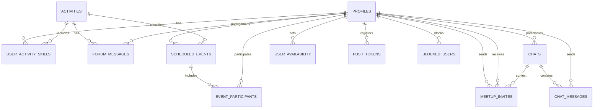

# System Architecture + Model

## Architecture Overview

The app follows a client‑heavy, backend‑light architecture optimized for fast iteration, cross‑platform delivery, and real‑time collaboration.

**Layers**
1. **UI Layer (Screens + Components)**
   - Screens live in `app/` (Expo Router).
   - Reusable UI lives in `components/`.
2. **Navigation**
   - Expo Router file‑based navigation.
   - Separate `(auth)` and `(tabs)` stacks.
3. **State & Local Logic**
   - Zustand for shared client state.
   - Contexts for app‑wide concerns (activity context, meeting reminders).
4. **Data Layer**
   - `hooks/` orchestrate Supabase queries and mutations.
5. **Backend**
   - Supabase (Auth + Postgres + Realtime + Storage + RLS).
6. **Notifications**
   - Expo Notifications for local/push alerts.

**Why this architecture**
- **Speed to ship**: minimal backend code, all backend services handled by Supabase.
- **Cross‑platform**: one React Native codebase for iOS/Android/Web.
- **Realtime**: built‑in Supabase realtime for chat + forum.
- **Maintainability**: clear separation of UI, state, and data access.

---

## Tech Stack (and Why)

**Core**
- **React Native + Expo**: cross‑platform, rapid iteration.
- **Expo Router**: clean, scalable file‑based navigation.
- **TypeScript**: safer refactors and fewer runtime errors.

**Backend**
- **Supabase**: Auth + Database + Realtime + Storage in one service.
- **RLS** (Row‑Level Security): access control at the database layer.

**State**
- **Zustand**: lightweight state container with minimal boilerplate.

**Native Capabilities**
- **expo‑location**: GPS + location permissions.
- **expo‑notifications**: local + push notifications.
- **expo‑image‑picker**: image selection + upload.

---

## Data Model (Why Each Entity Exists)

**Profiles**
- Stores user identity (name, email, avatar).
- Base entity for all social interactions.

**Activities**
- Master list of activities (e.g., Tennis, Hiking).
- Shared across the app to group users by interest.

**User Activity Skills**
- Connects users to activities with skill level.
- Enables filtering in People/Forum.

**Forum Messages**
- Public activity‑based discussion threads.

**Chats**
- 1:1 conversations between users.
- Tracks participants and last message timestamp.

**Chat Messages**
- Individual messages inside chats.
- Supports text + images.

**Meetup Invites**
- Direct 1:1 invites with location/date/time.
- Tracks status (pending/accepted/declined).

**Scheduled Events**
- Group meetups with multiple participants.

**Event Participants**
- Links users to scheduled events.
- Tracks invite status per user.

**User Availability**
- Weekly availability blocks for users.
- Surfaces who is free and when.

**Push Tokens**
- Stores device tokens for notifications.

**Blocked Users**
- Prevents communication and visibility between users.

---

## High‑Level Flow

1. **Auth**: Supabase auth session -> routes to tabs or login.
2. **Activity selection**: stored in Zustand -> filters Forum + People.
3. **Forum**: activity‑scoped public chat with realtime updates.
4. **People**: filtered by activity + location proximity.
5. **Chat**: 1:1 realtime messaging; schedule invites from chat.
6. **Meetups**: 1:1 invites + group scheduled events + reminders.

---

## Data Model Diagram

